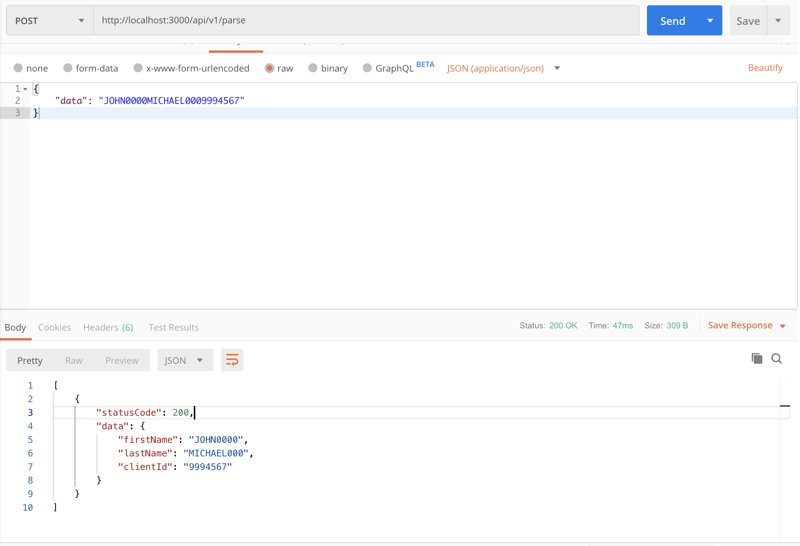

<h1 class="code-line" data-line-start=0 data-line-end=1 >NET (Nodejs - ExpressJS - TypeScript ) webApp .</h1>

#Functionality and Design 
A simple application  expose RESTful API  endpoints that do parse data &amp; return an JSON Object back to the client.

Endpoints 
/api/v1/parse (POST) 
/api/v2/parse (POST)

Request Body 
{ 
data: “JOHN0000MICHAEL0009994567” 
}

Expected Results 
/api/v1/parse – Response Body 
{ 
statusCode: 200, 
data:  { 
firstName: “JOHN0000”, 
lastName: “MICHAEL000”, 
clientId: “9994567” 
} 
}

/api/v2/parse – Response Body 
{ 
statusCode: 200, 
data:  { 
firstName: “JOHN”, 
lastName: “MICHAEL”, 
clientId: “999-4567” 
} 
}

 
An example request for endpoint /api/v1/parse

 
An example request for endpoint /api/v2/parse
